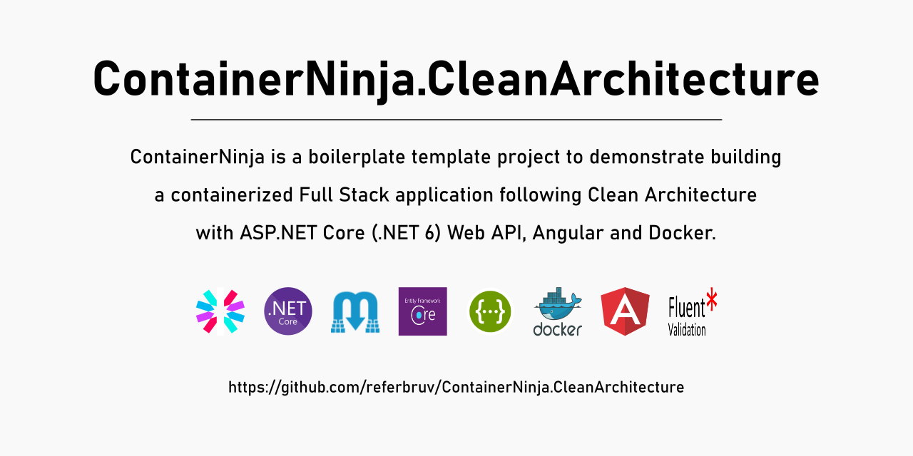

[](https://github.com/referbruv/ContainerNinja.CleanArchitecture/actions/workflows/dotnet.yml)
[](https://github.com/referbruv/ContainerNinja.CleanArchitecture/actions/workflows/docker-image.yml)

[](https://twitter.com/referbruv)

# What is this project about?

ContainerNinja is a boilerplate template project to demonstrate building a multi-container Full Stack application with ASP.NET Core (.NET 6) Web API following Clean Architecture, and Angular. The solution uses Docker Compose to orchestrate deployment of this entire stack to Docker.

# What does the Solution offer?

The Solution is built keeping in mind the most fundamental blocks an API must have in order to build a scalable and near-perfect API component. The solution offers a complete implementation of the following:

- [x] Clean Architecture with separated layers for API, Core, Contracts, Infra and Migrations
- [x] UnitOfWork with Generic Repository
- [x] Entity Framework Core migrations with SQLite
- [x] Complete CRUD for an Entity following CQRS, with segregated Commands and Queries
- [x] Fluent Validation of input inside the Command classes
- [x] Preconfigured Swagger UI
- [x] ETag generation and validation on the API side for Response Caching (GET) and Collision detection (PUT)
- [x] Ready to use Docker configuration with Dockerfiles
- [x] In-Memory Caching for single Entity via IMemoryCache
- [x] Distributed Caching implementation via IDistributedCache, with NCache 
- [x] JWT Token API for Generation and Configured JWT Validation
- [x] Roles based Authorization with predefined Roles
- [x] Auditable Entities with User Tracking
- [x] Complete Client Implementation of Entity CRUD and Token management in Angular
- [x] API Versioning with separated Swagger Documentation
- [x] AutoMapper implementation for Entity-to-DTO conversion
- [x] One Command deployment in Docker with Docker Compose
- [x] ILogger logging implementation
- [x] Database Seeding with a Single User and Roles added as the application starts

# Technologies Used

* ASP.NET Core (.NET 6) Web API
* Entity Framework Core (EFCore 6)
* MediatR for .NET 6
* Fluent Validation for .NET 6
* SQLite
* SwaggerUI
* AutoMapper
* Angular 13 (Client)
* Bootstrap 4 (CSS Framework)
* Nginx (Proxy)
* Docker Compose

# How do I get started with Docker Compose?

To get started, follow the below steps:

1. Install .NET 6 SDK
2. Install the latest NodeJS 
3. Install Docker Desktop (for Windows) / Docker (for Linux/Mac)
4. Clone the Solution into your Local Directory
5. On the Repository root you can find the docker-compose.yml file
6. Run the below command to build and run the solution in Docker (requires a working Docker installation)

```
> docker-compose build --force-rm --no-cache && docker-compose up
```

7. Once the containers start successfully navigate to http://localhost

# I'm not into Docker. How do I get started?

You can also just run the solution without Docker by following the steps below:

1. Install .NET 6 SDK
2. Install the latest NodeJS 
3. Clone the Solution into your Local Directory
4. Navigate to the API directory (./API) and run the below command to get the API running:

```
> dotnet run --project ./ContainerNinja.API
```

5. Navigate to the Client directory (./Client) and run the below commands to get the Angular application running:

```
> npm install && npm start
```

6. Open a browser, navigate to http://localhost:4200 and you're all set! 

# Default User:

The solution adds a default user to the database while starting up as a part of Seeding. You can use the below credentials to Login and start adding items.

```
EmailAddress: admin@admin.com; Password: admin
```

# What is Docker Compose?

Docker-Compose is a configuration file which contains instructions for the Docker about how services should be built from respective Dockerfiles. While a Dockerfile aims at creating and customizing application containers by means of base images and instructions, the Docker-Compose file works on top of the Dockerfile and helps developers in running docker containers with complex runtime specifications such as ports, volumes and so on.

Read more: [Dockerizing a Full Stack Application with Docker Compose](https://referbruv.com/blog/posts/dockerizing-multiple-services-integrating-angular-with-aspnetcore-api-via-docker-compose)

# Issues or Ideas?

If you face any issues or would like to drop a suggestion, 

# License

The solution is completely open source and is licensed with MIT License.

# Show your Support 

I really hope this solution helps developers get started on building awesome things with ASP.NET Core (.NET 6) Web API and get into the world of containerized development real quick. 

Found this solution helpful and useful? You can do these to help this reach greater audience.

1. Leave a star on this repository :star:
2. Recommend this solution to your colleagues and dev community
3. Join my [Twitter family](https://twitter.com/referbruv). I regularly post awesome content on dev over there.
4. Join my [Facebook community](https://www.facebook.com/referbruv). I regularly post interesting content over there as well.
5. You can also buy me [a cup of great coffee :coffee:](https://www.buymeacoffee.com/referbruv)!

<a href="https://www.buymeacoffee.com/referbruv" target="_blank"></a>

For more detailed articles and how-to guides, visit https://referbruv.com
